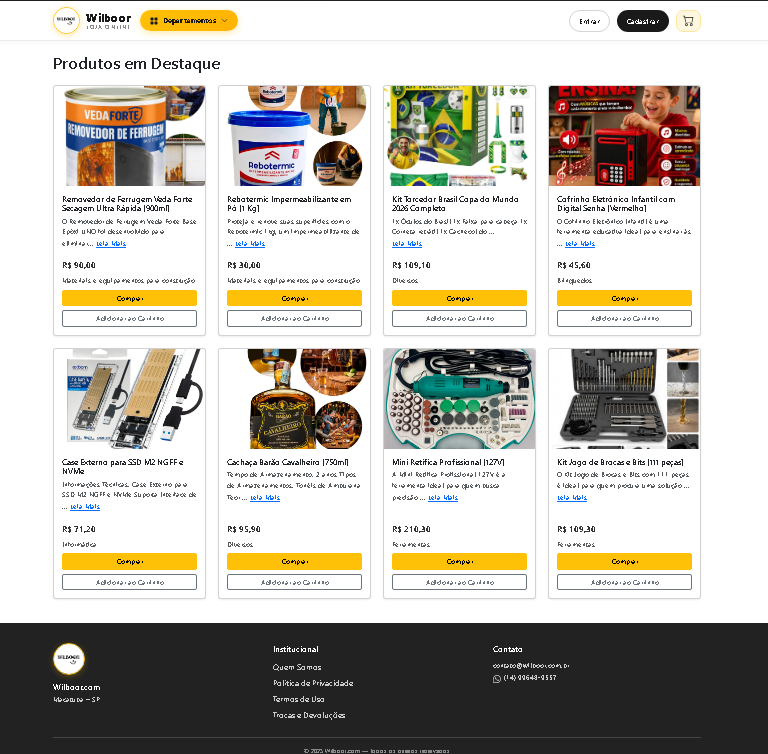
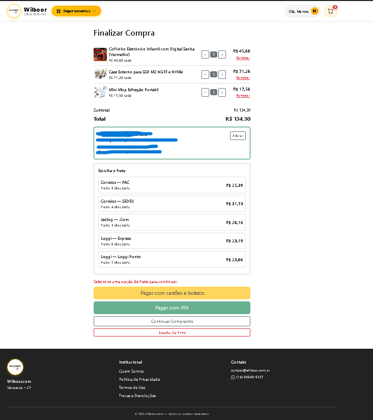
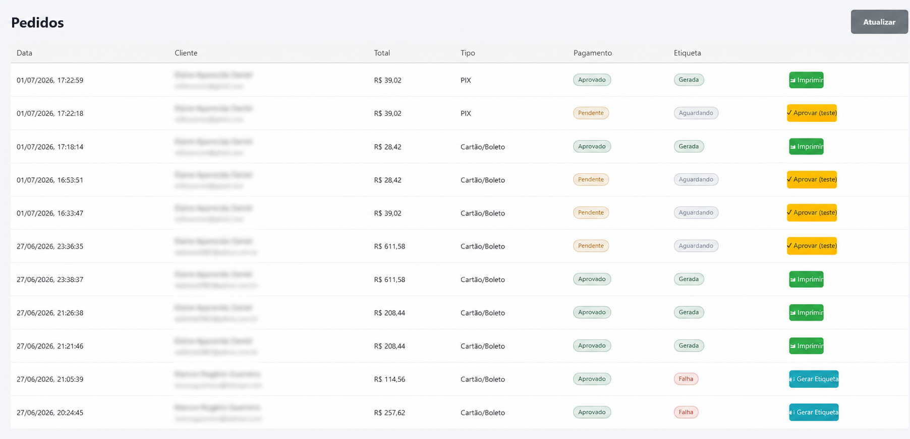

# Wilboor — E-commerce completo (PIX, cartão e etiquetas automáticas)

> **Vitrine de projeto.** Este repositório apresenta um e-commerce full-stack que desenvolvi e mantenho em produção. O **código-fonte é privado** — disponível para avaliação mediante contato.

🔗 **Veja funcionando:** [https://wilboor.com.br](https://wilboor.com.br)

---

## O que é

Loja virtual completa, do catálogo à etiqueta de envio, com **pagamentos reais** (Mercado Pago: cartão, boleto e PIX) e **integração de logística** (Melhor Envio) que **gera a etiqueta de transporte automaticamente** assim que o pagamento é confirmado.

Não é um clone de tutorial: está **no ar, processando pedidos de verdade**, incluindo webhooks de pagamento, e-mails transacionais e um painel administrativo próprio.

---

## Demonstração

▶️ **A melhor forma de ver é acessar o site no ar:** [wilboor.com.br](https://wilboor.com.br)

<!--
  Para adicionar prints: salve as imagens em docs/ (home.png, checkout.png,
  admin-pedidos.png) e descomente a tabela abaixo.

| Loja | Checkout | Painel Admin |
|------|----------|--------------|
|  |  |  |
-->

---

## Principais funcionalidades

### Cliente
- Cadastro com **validação de CPF** (dígitos verificadores) e verificação de e-mail
- Recuperação de senha por token
- **Minha Conta**: edição de dados e **endereço de entrega separado do residencial**
- Carrinho com **cálculo de frete em tempo real** por CEP (peso/dimensões reais, múltiplos itens agregados em um pacote)
- Pagamento por **cartão, boleto e PIX**
- **PIX com confirmação automática na tela** (a página detecta o pagamento e avisa)
- Retorno automático ao site com página de pedido confirmado

### Administrativo
- Gestão de produtos (criar, editar, destacar, pausar/publicar)
- Gestão de clientes e fornecedores
- **Painel de pedidos** com status de pagamento e etiqueta
- **Verificação segura de pagamento** (consulta o status real no Mercado Pago, sem aprovar nada na marra)
- Geração e reemissão de etiquetas; tratamento de saldo insuficiente

### Automação
- **Webhook do Mercado Pago** → confirma o pagamento e **dispara a etiqueta**
- Emissão automática na Melhor Envio (carrinho → checkout → gerar → imprimir)
- E-mails automáticos: novo pedido, etiqueta gerada e aviso de saldo insuficiente

---

## Arquitetura

```
┌────────────────────┐     HTTPS      ┌─────────────────────────────┐
│   React 19 (SPA)   │ ─────────────▶ │   Express 5 (API + estático)│
│  Bootstrap, Axios  │                │   serve o build do React    │
└────────────────────┘                └───────────┬─────────────────┘
                                                   │
        ┌──────────────────────┬───────────────────┼───────────────────┐
        ▼                      ▼                   ▼                   ▼
   ┌─────────┐          ┌──────────────┐   ┌──────────────┐    ┌──────────────┐
   │ MongoDB │          │ Mercado Pago │   │ Melhor Envio │    │  Brevo (mail)│
   │(Mongoose)│         │  pagamentos  │   │ frete/etiqueta│   │ transacional │
   └─────────┘          └──────────────┘   └──────────────┘    └──────────────┘
```

Deploy em serviço **Node único no Render**: o Express compila e serve o frontend, expõe a API e recebe o webhook de pagamento. `index.html` servido com `no-cache` para nunca ficar preso em versão antiga; assets com hash têm cache longo.

---

## Stack

| Camada | Tecnologias |
|--------|-------------|
| Frontend | React 19, React Router 7, Axios, Bootstrap 5 / React-Bootstrap |
| Backend | Node.js, Express 5, Mongoose 9 |
| Banco | MongoDB |
| Auth | JWT (access + refresh token rotativo), bcrypt |
| Pagamentos | Mercado Pago API |
| Logística | Melhor Envio API |
| E-mail | Brevo API |
| Infra | Render, MongoDB Atlas |

---

## Destaques de engenharia

- **Webhook resiliente:** o Mercado Pago não envia o status no corpo da notificação — o sistema consulta o pagamento na API para confirmar antes de aprovar e emitir etiqueta (idempotente).
- **Frete correto:** cálculo com peso e dimensões reais dos produtos, empilhando volumes de múltiplos itens; a etiqueta usa exatamente o pacote cotado.
- **Segurança de operação:** aprovação de pedido só acontece com confirmação real do Mercado Pago; exclusão bloqueada para pedidos pagos.
- **Boas práticas:** segredos fora do versionamento, Helmet, rate limiting, CORS restrito, validação de entrada e limite de payload.

---

## Sobre o código

O código-fonte é **proprietário e privado**. Tenho prazer em apresentá-lo em uma conversa ou conceder acesso de leitura ao repositório para processos seletivos.

**Contato:** [wilboor.com@gmail.com](mailto:wilboor.com@gmail.com)
