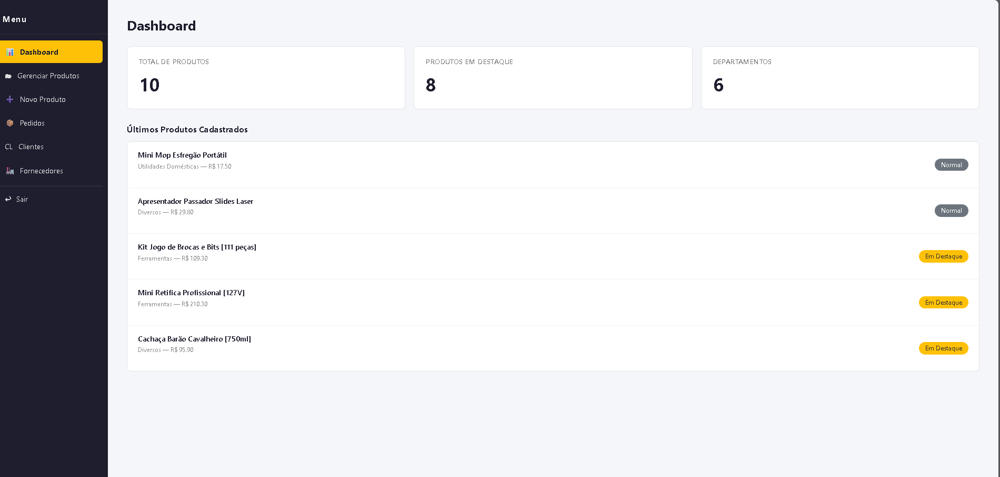
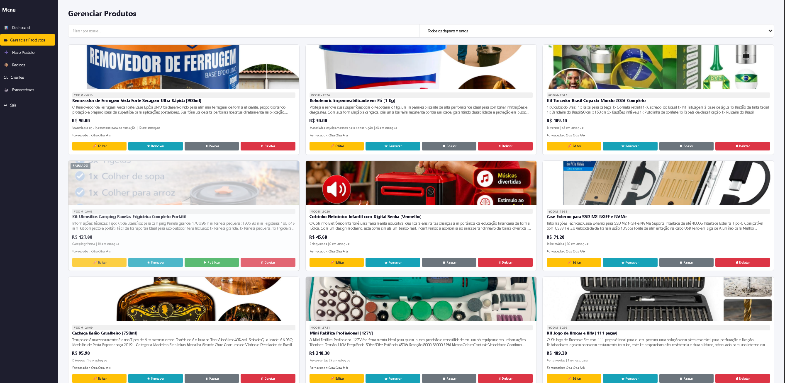

# 🛒 Wilboor — E-commerce full-stack em produção

**Loja virtual completa, do catálogo à etiqueta de envio — com pagamentos reais (PIX, cartão e boleto) e logística automatizada.** Projeto individual, desenvolvido do zero e **rodando em produção com pedidos de verdade**.


### 🔗 [Acesse o site no ar → wilboor.com.br](https://wilboor.com.br)

> **Vitrine de projeto.** O **código-fonte é privado**; concedo acesso de leitura para avaliação em processos seletivos. Fale comigo: [wilboor.com@gmail.com](mailto:wilboor.com@gmail.com)

---

## ✨ Por que este projeto se destaca

- 💳 **Pagamentos reais** integrados ao Mercado Pago — PIX (com QR Code e confirmação automática na tela), cartão e boleto
- 🏷️ **Logística automatizada:** assim que o pagamento é confirmado, o sistema **gera a etiqueta de transporte sozinho** na Melhor Envio
- 🔄 **Não é um clone de tutorial:** está no ar, com webhooks, e-mails transacionais e painel administrativo próprio, atendendo pedidos de verdade
- 🧱 **Full-stack de ponta a ponta:** frontend, backend, banco, integrações, deploy e operação — tudo feito por mim

---

## 📸 Demonstração

▶️ **Melhor ainda: veja funcionando em** [wilboor.com.br](https://wilboor.com.br)

### Loja

| Página inicial | Checkout com frete calculado |
|:---:|:---:|
|  |  |

### Painel administrativo

| Dashboard | Pedidos — pagamento e etiqueta |
|:---:|:---:|
|  |  |

**Gestão de produtos** (com peso e dimensões que alimentam o cálculo de frete)



---

## 🚀 Funcionalidades

### Cliente
- Cadastro com **validação de CPF** (dígitos verificadores) e verificação de e-mail
- Recuperação de senha por token
- **Minha Conta**: edição de dados e **endereço de entrega separado do residencial**
- Carrinho com **cálculo de frete em tempo real** por CEP (peso/dimensões reais, múltiplos itens agregados em um pacote)
- Pagamento por **cartão, boleto e PIX**
- **PIX com confirmação automática na tela** (a página detecta o pagamento e avisa)
- Retorno automático ao site com página de pedido confirmado

### Administrativo
- Gestão de produtos (criar, editar, destacar, pausar/publicar)
- Gestão de clientes e fornecedores
- **Painel de pedidos** com status de pagamento e de etiqueta
- **Verificação segura de pagamento** (consulta o status real no Mercado Pago — nunca aprova "na marra")
- Geração e reemissão de etiquetas; tratamento de saldo insuficiente

### Automação
- **Webhook do Mercado Pago** → confirma o pagamento e **dispara a etiqueta**
- Emissão automática na Melhor Envio (carrinho → checkout → gerar → imprimir)
- E-mails automáticos: novo pedido, etiqueta gerada e aviso de saldo insuficiente

---

## 🏗️ Arquitetura

```
┌────────────────────┐     HTTPS      ┌─────────────────────────────┐
│   React 19 (SPA)   │ ─────────────▶ │  Express 5 (API + estático) │
│  Bootstrap, Axios  │                │   serve o build do React    │
└────────────────────┘                └───────────┬─────────────────┘
                                                   │
        ┌──────────────────────┬───────────────────┼───────────────────┐
        ▼                      ▼                    ▼                   ▼
   ┌──────────┐        ┌──────────────┐    ┌───────────────┐   ┌──────────────┐
   │ MongoDB  │        │ Mercado Pago │    │ Melhor Envio  │   │ Brevo (mail) │
   │(Mongoose)│        │  pagamentos  │    │ frete/etiqueta│   │ transacional │
   └──────────┘        └──────────────┘    └───────────────┘   └──────────────┘
```

Deploy em **serviço Node único no Render**: o Express compila e serve o frontend, expõe a API e recebe o webhook de pagamento. O `index.html` é servido com `no-cache` (nunca fica preso em versão antiga) e os assets com hash têm cache longo.

---

## 🧰 Stack

| Camada | Tecnologias |
|--------|-------------|
| Frontend | React 19, React Router 7, Axios, Bootstrap 5 / React-Bootstrap |
| Backend | Node.js, Express 5, Mongoose 9 |
| Banco | MongoDB |
| Auth | JWT (access + refresh token rotativo), bcrypt |
| Pagamentos | Mercado Pago API |
| Logística | Melhor Envio API |
| E-mail | Brevo API |
| Infra | Render, MongoDB Atlas |

---

## 🧠 Destaques de engenharia

- **Webhook resiliente:** o Mercado Pago não envia o status no corpo da notificação — o sistema consulta o pagamento na API antes de aprovar e emitir etiqueta, de forma **idempotente** (não gera etiqueta duplicada).
- **Frete correto:** cálculo com peso e dimensões reais dos produtos, empilhando volumes de múltiplos itens; a etiqueta usa exatamente o pacote cotado.
- **Segurança de operação:** aprovação de pedido só acontece com confirmação real do Mercado Pago; exclusão bloqueada para pedidos pagos.
- **Boas práticas:** segredos fora do versionamento, Helmet, rate limiting, CORS restrito, validação de entrada e limite de payload.

---

## 👤 Meu papel no projeto

Projeto **individual, do zero à produção**. Sou responsável por:

- **Produto e UX** — concepção das telas e do fluxo de compra
- **Frontend** — SPA em React (loja + painel administrativo)
- **Backend** — API REST em Express, autenticação, regras de negócio
- **Integrações** — Mercado Pago (pagamentos + webhook), Melhor Envio (frete + etiquetas), Brevo (e-mails)
- **Infra e operação** — deploy no Render, banco no MongoDB Atlas e **manutenção do sistema em produção**

---

## 📬 Sobre o código & contato

O código-fonte é **proprietário e privado**. Tenho prazer em apresentá-lo em uma conversa ou conceder acesso de leitura ao repositório para processos seletivos.

**Contato:** [wilboor.com@gmail.com](mailto:wilboor.com@gmail.com)
